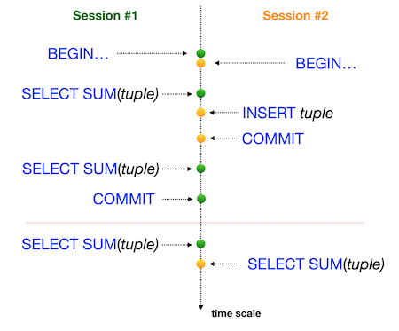

# Day 08 — SQL Bootcamp

## _Isolation is one of ACID properties_

Resume: Today you will see how database works with transactions and isolation levels.

## Rules of the day

- Please make sure you have your own database and access to it on your PostgreSQL cluster. 
- Please download a [script](materials/model.sql) with Database Model here and apply the script to your database (you can use command line with psql or just run it through any IDE, for example DataGrip from JetBrains or pgAdmin from PostgreSQL community). **Our knowledge way is incremental and linear therefore please be aware all changes that you made in Day03 during Exercises 07-13 and in Day04 during Exercise 07 should be on place (its similar like in real world, when we applied a release and need to be consistency with data for new changes).**
- All tasks contain a list of Allowed and Denied sections with listed database options, database types, SQL constructions etc. Please have a look at the section before you start.
- Please take a look at the Logical View of our Database Model. 

1. **pizzeria** table (Dictionary Table with available pizzerias)
- field id — primary key
- field name — name of pizzeria
- field rating — average rating of pizzeria (from 0 to 5 points)
2. **person** table (Dictionary Table with persons who loves pizza)
- field id — primary key
- field name — name of person
- field age — age of person
- field gender — gender of person
- field address — address of person
3. **menu** table (Dictionary Table with available menu and price for concrete pizza)
- field id — primary key
- field pizzeria_id — foreign key to pizzeria
- field pizza_name — name of pizza in pizzeria
- field price — price of concrete pizza
4. **person_visits** table (Operational Table with information about visits of pizzeria)
- field id — primary key
- field person_id — foreign key to person
- field pizzeria_id — foreign key to pizzeria
- field visit_date — date (for example 2022-01-01) of person visit 
5. **person_order** table (Operational Table with information about persons orders)
- field id — primary key
- field person_id — foreign key to person
- field menu_id — foreign key to menu
- field order_date — date (for example 2022-01-01) of person order 

People's visit and people's order are different entities and don't contain any correlation between data. For example, a customer can be in a restaurant (just looking at the menu) and in that time place an order in another restaurant by phone or mobile application. Or another case, just be at home and again make a call with order without any visits.

## Exercise 00 — Simple transaction

| Exercise 00: Simple transaction |                                                                                                                          |
|---------------------------------------|--------------------------------------------------------------------------------------------------------------------------|
| Turn-in directory                     | ex00                                                                                                                     |
| Files to turn-in                      | `day08_ex00.sql` with comments for Session #1, Session #2 statements; screenshot of psql output for Session #1; screenshot of psql output for Session #2 |
| **Allowed**                               |                                                                                                                          |
| Language                        |  SQL|

Please use the command line for PostgreSQL database (psql) for this task. You need to check how your changes will be published to the database for other database users. 

Actually, we need two active sessions (i.e. 2 parallel sessions in the command line). 

Please provide a proof that your parallel session can’t see your changes until you will make a `COMMIT`;

See the steps below.

**Session #1**
- Update of rating for "Pizza Hut" to 5 points in a transaction mode.
- Check that you can see a changes in session #1.

**Session #2**
- Check that you can’t see a changes in session #2.

**Session #1**
- Publish your changes for all parallel sessions.

**Session #2**
- Check that you can see a changes in session #2.

So, take a look on example of our output for Session #2.

    pizza_db=> select * from pizzeria where name  = 'Pizza Hut';
    id |   name    | rating
    ----+-----------+--------
    1 | Pizza Hut |    4.6
    (1 row)

    pizza_db=> select * from pizzeria where name  = 'Pizza Hut';
    id |   name    | rating
    ----+-----------+--------
    1 | Pizza Hut |      5
    (1 row)

You can see that the same query returns different results because the first query was run before publishing in Session#1 and the second query was run after Session#1 was finished.

## Exercise 01 — Lost Update Anomaly

| Exercise 01: Lost Update Anomaly|                                                                                                                          |
|---------------------------------------|--------------------------------------------------------------------------------------------------------------------------|
| Turn-in directory                     | ex01                                                                                                                     |
| Files to turn-in                      | `day08_ex01.sql` with comments for Session #1, Session #2 statements; screenshot of psql output for Session #1; screenshot of psql output for Session #2                                                                                 |
| **Allowed**                               |                                                                                                                          |
| Language                        |  SQL                                                                                              |

Please use the command line for PostgreSQL database (psql) for this task. You need to check how your changes will be published to the database for other database users. 

Actually, we need two active sessions (i.e. 2 parallel sessions in the command line). 

Before running a task, make sure you are at a standard isolation level in your database. Just run the following statement `SHOW TRANSACTION ISOLATION LEVEL;` and the result should be "read committed".

If not, please set the read committed isolation level explicitly on a session level.

|  |  |
| ------ | ------ |
| Let's examine one of the famous "Lost Update Anomaly" database patterns. You can see a graphical representation of this anomaly on a picture. The horizontal red line represents the final results after all the sequential steps for both Sessions. |  |

Please check a rating for "Pizza Hut" in a transaction mode for both sessions and then make an `UPDATE` of the rating to a value of 4 in Session #1 and make an `UPDATE` of the rating to a value of 3.6 in Session #2 (in the same order as in the picture).

## Exercise 02 — Lost Update for Repeatable Read

| Exercise 02: Lost Update for Repeatable Read|                                                                                                                          |
|---------------------------------------|--------------------------------------------------------------------------------------------------------------------------|
| Turn-in directory                     | ex02                                                                                                                     |
| Files to turn-in                      | `day08_ex02.sql` with comments for Session #1, Session #2 statements; screenshot of psql output for Session #1; screenshot of psql output for Session #2                                                                                  |
| **Allowed**                               |                                                                                                                          |
| Language                        |  SQL                                                                                              |

Please use the command line for PostgreSQL database (psql) for this task. You need to check how your changes will be published to the database for other database users. 

Actually, we need two active sessions (i.e. 2 parallel sessions in the command line).

|  |  |
| ------ | ------ |
| Let's examine one of the famous "Lost Update Anomaly" database patterns, but under the `REPEATABLE READ` isolation level. You can see a graphical representation of this anomaly on a picture. Horizontal red line means the final results after all sequential steps for both Sessions. |  |

Please check a rating for "Pizza Hut" in a transaction mode for both sessions and then make an `UPDATE` of the rating to a value of 4 in Session #1 and make an `UPDATE` of the rating to a value of 3.6 in Session #2 (in the same order as in the picture).

## Exercise 03 — Non-Repeatable Reads Anomaly

| Exercise 03: Non-Repeatable Reads Anomaly |                                                                                                                          |
|---------------------------------------|--------------------------------------------------------------------------------------------------------------------------|
| Turn-in directory                     | ex03                                                                                                                     |
| Files to turn-in                      | `day08_ex03.sql` with comments for Session #1, Session #2 statements; screenshot of psql output for Session #1; screenshot of psql output for Session #2                                                                                 |
| **Allowed**                               |                                                                                                                          |
| Language                        |  SQL                                                                                              |

Please use the command line for PostgreSQL database (psql) for this task. You need to check how your changes will be published to the database for other database users. 

Actually, we need two active sessions (i.e. 2 parallel sessions in the command line).

|  |  |
| ------ | ------ |
| Let's check one of the famous "Non-Repeatable Reads" database patterns, but under the `READ COMMITTED` isolation level. You can see a graphical representation of this anomaly on a picture. The horizontal red line represents the final result after all sequential steps for both Sessions. |  |

Please check a rating for "Pizza Hut" in a transaction mode for Session #1 and then make an `UPDATE` of the rating to a value of 3.6 in Session #2 (in the same order as in the picture).

## Exercise 04 — Non-Repeatable Reads for Serialization

| Exercise 04: Non-Repeatable Reads for Serialization |                                                                                                                          |
|---------------------------------------|--------------------------------------------------------------------------------------------------------------------------|
| Turn-in directory                     | ex04                                                                                                                     |
| Files to turn-in                      | `day08_ex04.sql` with comments for Session #1, Session #2 statements; screenshot of psql output for Session #1; screenshot of psql output for Session #2                                                                                 |
| **Allowed**                               |                                                                                                                          |
| Language                        |  SQL                                                                                              |

Please use the command line for PostgreSQL database (psql) for this task. You need to check how your changes will be published to the database for other database users. 

Actually, we need two active sessions (i.e. 2 parallel sessions in the command line).

|  |  |
| ------ | ------ |
| Let's check one of the famous "Non-Repeatable Reads" database patterns, but under the `SERIALIZABLE` isolation level. You can see a graphical representation of this anomaly on a picture. The horizontal red line represents the final results after all sequential steps for both Sessions. |  |

Please check a rating for "Pizza Hut" in a transaction mode for Session #1, and then make an `UPDATE` of the rating to a value of 3.0 in Session #2 (in the same order as in the picture).

## Exercise 05 — Phantom Reads Anomaly

| Exercise 05: Phantom Reads Anomaly|                                                                                                                          |
|---------------------------------------|--------------------------------------------------------------------------------------------------------------------------|
| Turn-in directory                     | ex05                                                                                                                     |
| Files to turn-in                      | `day08_ex05.sql`  with comments for Session #1, Session #2 statements; screenshot of psql output for Session #1; screenshot of psql output for Session #2                                                                                 |
| **Allowed**                               |                                                                                                                          |
| Language                        |   SQL                                                                                              |

Please use the command line for PostgreSQL database (psql) for this task. You need to check how your changes will be published to the database for other database users. 

Actually, we need two active sessions (i.e. 2 parallel sessions in the command line).

|  |  |
| ------ | ------ |
| Let's check one of the famous "phantom reads" database patterns, but under the `READ COMMITTED` isolation level. You can see a graphical representation of this anomaly on a picture. The horizontal red line represents the final results after all sequential steps for both Sessions. |  |

Please summarize all ratings for all pizzerias in one transaction mode for Session #1 and then make `INSERT` of the new restaurant 'Kazan Pizza' with rating 5 and ID=10 in Session #2 (in the same order as in the picture).
 

## Exercise 06 — Phantom Reads for Repeatable Read

| Exercise 06: Phantom Reads for Repeatable Read|                                                                                                                          |
|---------------------------------------|--------------------------------------------------------------------------------------------------------------------------|
| Turn-in directory                     | ex06                                                                                                                     |
| Files to turn-in                      | `day08_ex06.sql`  with comments for Session #1, Session #2 statements; screenshot of psql output for Session #1; screenshot of psql output for Session #2                                                                                 |
| **Allowed**                               |                                                                                                                          |
| Language                        |  SQL                                                                                              |

Please use the command line for PostgreSQL database (psql) for this task. You need to check how your changes will be published to the database for other database users. 

Actually, we need two active sessions (i.e. 2 parallel sessions in the command line).

|  |  |
| ------ | ------ |
| Let's check one of the famous "Phantom Reads" database patterns, but under the isolation level `REPEATABLE READ`. You can see a graphical representation of this anomaly on a picture. The horizontal red line represents the final results after all sequential steps for both Sessions. |  |

Please summarize all ratings for all pizzerias in one transaction mode for Session #1 and then make `INSERT` of the new restaurant 'Kazan Pizza 2' with rating 4 and ID=11 in Session #2 (in the same order as in the picture).

## Exercise 07 — Deadlock

| Exercise 07: Deadlock|                                                                                                                          |
|---------------------------------------|--------------------------------------------------------------------------------------------------------------------------|
| Turn-in directory                     | ex07                                                                                                                     |
| Files to turn-in                      | `day08_ex07.sql`    with comments for Session #1, Session #2 statements; screenshot of psql output for Session #1; screenshot of psql output for Session #2                                                                                |
| **Allowed**                               |                                                                                                                          |
| Language                        |  SQL                                                                                              |

Please use the command line for PostgreSQL database (psql) for this task. You need to check how your changes will be published to the database for other database users. 

Actually, we need two active sessions (i.e. 2 parallel sessions in the command line).

Let’s reproduce a deadlock situation in our database. 

|  |  |
| ------ | ------ |
| You can see a graphical representation of the deadlock situation in a picture. It looks like a "Christ-lock" between parallel sessions. |  |

Please write any SQL statement with any isolation level (you can use the default setting) on the table `pizzeria` to reproduce this deadlock situation.

